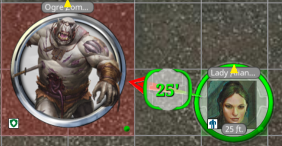

# Token Height Indicator for FGU (all rulesets)

 ## Features
 * This extension allows the height of each token to be set / displayed by holding down the alt key and using the scroll wheel. The token * orientation is changed with shift and scroll wheel and the token scale is changed with control and scroll wheel. The height can only be set by tokens in the combat tracker.

*     Ranges (both the range arrow and via the getDistanceBetweenTokens call for use by other extensions) are updated accordingly.
*    Shape support (for use by other extensions):

*       TokenHeight.getTokensWithinShape(originToken, shape, distance, height, width, azimuthalAngle, polarAngle)
*       Image.getTokensWithinShapeFromToken(originItem, shape, distance, height, width, azimuthalAngle, polarAngle)
*       Image.getTokensWithinShape(originX, originY, originZ, shape, distance, height, width, azimuthalAngle, polarAngle)

*       Get all tokens within a shape (including the origin token, if any).  Any token with any part of its containing cube will be returned.  I know there is a lot of debate and variations on how much of a token needs to overlap for a given shape type.  As such, I'm returning all, as it's easier to remove tokens you don't want than to add...

*       The parameters for each type of shape are:
     

*        All:  
*            originX, originY, originZ - the coordinates of the center / origin of the shape
*            shape - "sphere", "cube", "cylinder", "line", "cone"
*        sphere:
*            distance = radius of the sphere
*        cube:
*            distance = length of each side of the cube
*        cylinder:
*            distance = radius of the sphere
*            height = height of the cylinder
*        line:
*            distance = length of the line
*            width = width of the line (half on each side of the line in all directions)
*            azimuthalAngle = angle of the line leaving the origin in the X/Y plane in degrees. 0 = north, 90 = east
*            polarAngle = angle of the line leaving the origin in the X/Z plane in degrees. 0 = flat, 90 = straight up
*        cone:
*            distance = length of the cone
*            width = angle of the cone aperture (53 in 5E, 90 in 3.5/PFRPG)
*            azimuthalAngle = angle of the center of the cone leaving the origin in the X/Y plane in degrees. 0 = north, 90 = east
*            polarAngle = angle of the center of the cone leaving the origin in the X/Z plane in degrees. 0 = flat, 90 = straight up

 

##    Methods for range
*    My goal is to the mirror the spirit of each style in the rulesets, not necessarily to provide the most accurate result (which will always be raw). As such:

*    5E Standard: 2D formula is max(x delta, y delta). My formula is max(x delta, y delta, z delta)

*    5E Variant / most other rulesets: "Variant Diagonal Style" option to account for two schools of thought on whether the distance between a token at 0,0,0 and one at 5,5,5 is 5ft or 10ft. The only difference between the two options is when all three deltas are the same.
    "Long": 2D formula is longer delta + 1/2 shorter delta. My formula is longest delta + 1/2 other two deltas.
    "Short": 2D formula is longer delta + 1/2 shorter delta. My formula is longest delta + 1/2 middle delta (ignoring smallest delta).

*    5E Raw Variant / "Raw Distance" option on maps for other rulesets: 2D formula is sqrt(x2+y2). My formula is sqrt(x2+y2+z2).

*    There are lots of ways to make 5E Standard / variant measurements more "accurate", but that goes against the spirit of those rulesets. If you want to be entirely accurate, then you should use the raw measurements.

##    Known Bugs / Future plans
*    - This is for FGU only; it will not work with FGC
*    - Tested with 5E / 4E / 3.5E / Pathfinder 1&2 / Starfinder / MoreCore; others should work but have not been tested
*    - Height of an NPC will get reset when taking / removing control of that NPC with GM Assistant